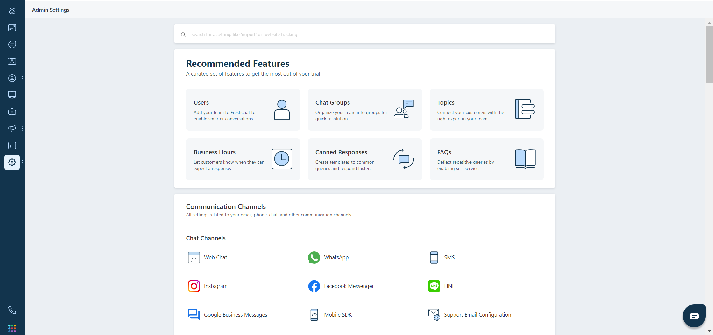
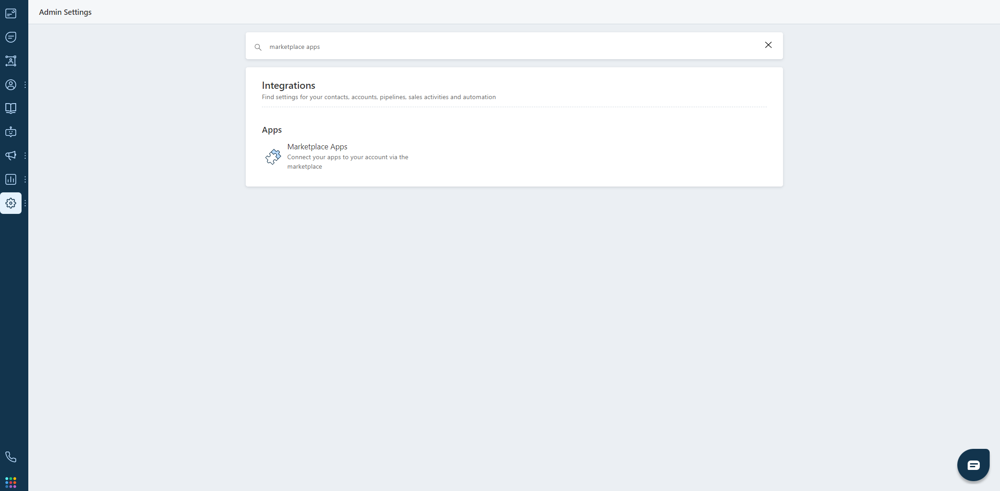
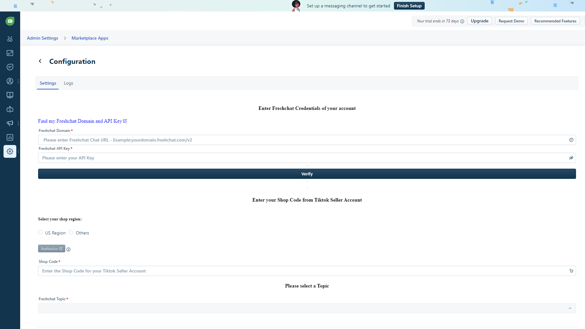
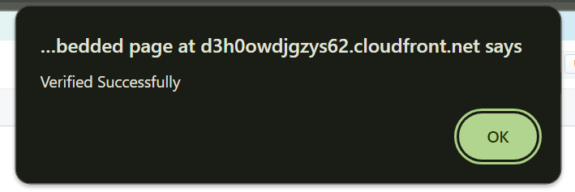
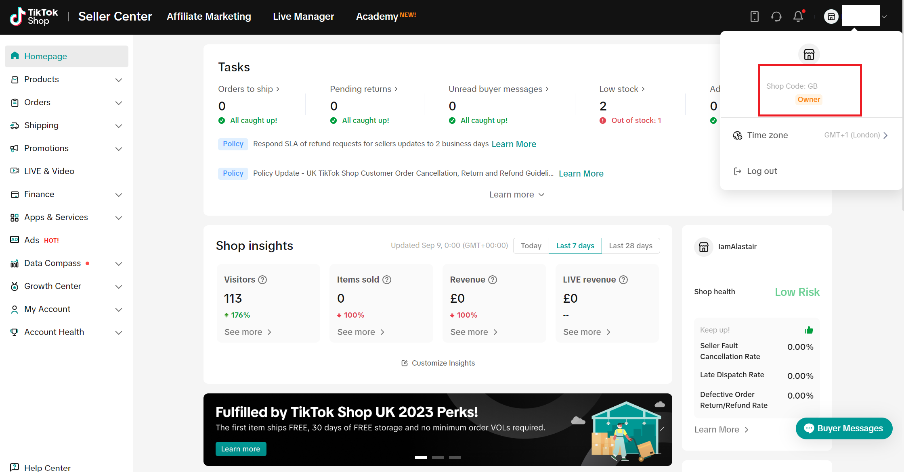

# Freshchat app install.

In this guide we will guide you the steps for installing our application from Freshworks Marketplace. These steps will be navigating you once you have logged into Freshchat.

#### Step 1: Navigate to the Admin Settings page.

In the side bar select the "Adim Settings" option.

#### Step 2: Search for Marketplace Apps.

Search for "Marketplace Apps" in the serach bar In the Marketplace Apps page and then navigate to the Marketplace App page.

#### Step 3: Installation page for the app.

In the Marketplace Apps page search for our app "Tiktok Seller Chat" in the search bar. Once you reach our app page, click the install button which will navigate you to the app installation parameters page.

#### Step 4: Copy the  credientals.

From the "Admin Settings" page, navigate to your login logo, which is in the top right corner and select the "Settings" option. In that settings page select the "Api Settings" tab and copy only the credientals which is under the "API DETAILS FOR CHAT" heading.

#### Step 5: Fill in the Freshchat related details.

From the credientals that you copied, paste it in the appropriate fields, i.e., the "Freshchat Domain" and "Freshchat API Key" and click the "Verify" button.

#### Step 6: Verify the credientals:

If the credientals are appropriate, you will receive a "Verified Successfully" notification on the top.

##### NOTE: Only proceed to the next step if you recieve the "Verified Successfully" notification.

#### Step 7: Fill in the Tiktok Seller Chat Shop Code.

Login to your Tiktok Seller Account and navigate to your shop name in the top right corner and copy the shop code and paste it in the "Tiktok Seller Shop Code".

#### Step 9: Select the Freshchat Topic:

Select the desired Freshchat Topic fromt he dropdown that suits your purpose.

#### Step 10: Install the app.

Finally install the app. You will be receiving a notification on the top denoting "App Installed".

