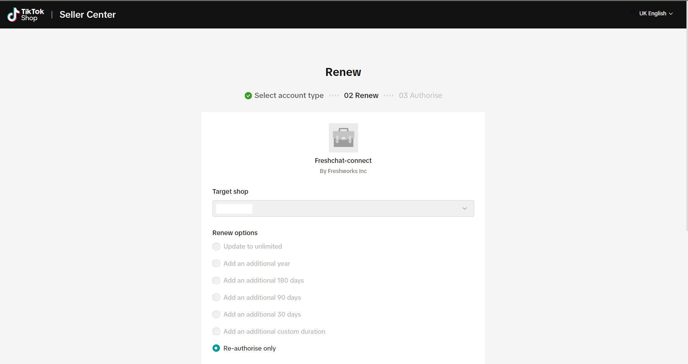

 # Tiktok Seller Account Shop Authorization

In this guide, we will walk you through the authorization process of our service.

#### Step 1: Open the link your browser.

In the address bar, enter the given URL and ensure that the browser window resembles the image below:

#### Step 2: Select your shop region. 

For United Kingdom, select the European seller and for other region select the Asia seller.

#### Step 3: Check for your shop name in the target shop.

If the target shop is the same as your shop name, then proceed to the next screen.

#### Step 4: Authorise our app.

Kindly go through the list of services that are provided by our app, only then authorise it.

#### Step 5: You will be redirected to a static page.

After authorizing you will be redirected to a static page. Wait for a few seconds; you will we redirected to another static web page automatically.

#### Step 6: Copy the complete browser URL link:

Finally you will be redirected to a Webpage page. Wait for around 05 seconds.
